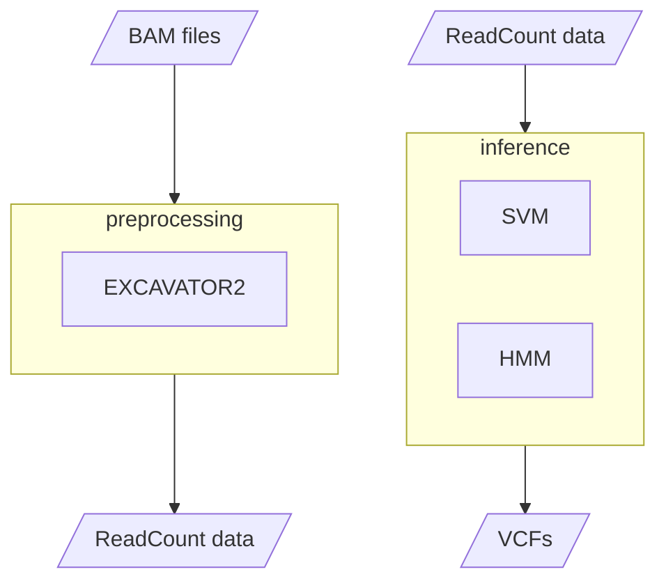

[](https://github.com/ctglab/mixer/actions/workflows/testing.yml)


# miXer:a Machine-learning method to detect genomic Imbalances exploiting X-chromosome Exome Reads

miXer (with a capital X) is a lightweight machine learning tool designed to detect genomic deletions and duplications by exploiting the natural difference in X-chromosome copy number between male and female exomes. It builds on [EXCAVATOR2](https://github.com/ctglab/excavator2) [](https://doi.org/10.1093/nar/gkw695)
 for data preprocessing and combines two key components: a single-exon Copy Number (CN) classifier based on Support Vector Machines (SVM), trained on data from six widely used exome sequencing kits; and a post-classification step that uses a Hidden Markov Model (HMM) for filtering and aggregation.



## Setup

To run miXer, one of [Docker](https://www.docker.com/), [Apptainer](https://apptainer.org/) or [Singularity](https://docs.sylabs.io/guides/4.3/user-guide/) must be installed on the machine. 

Clone the repository:<br>
```git clone https://github.com/ctglab/miXer```

Download the support files from the [Zenodo repository](https://zenodo.org/records/15829608) and place them in a folder with reading/writing permissions. The archive contains the following files:

- **CentromerePosition_hgVersion.txt**: Containing the coordinates of the centromeres for the considered human genome assembly.
- **ChromosomeCoordinate_hgVersion.txt**: Containing the coordinates of chromosomes.
- **Gap_hgVersion.txt**: Containing gap annotations.
- **mappability_track_hgVersion.bw**: Encodes genome-wide mappability.
- **GRC_pseudoautosomal_regions_hgVersion.gz**: Containing the coordinates of the pseudoautosomal regions (PARs) for the considered human genome assembly.


The BigWig files encode genome-wide mappability for hg19 and hg38 assemblies and are required in order to annotate each target region. They were produced with the GEM mapper (Derrien et al., 2012) from the GEM suite (https://gemlibrary.sourceforge.net/), using 100 bp sliding windows and allowing up to two mismatches.


## Running miXer: Requirements and Configuration Steps

miXer requires the following resources to be configured before running:

- config.json
- sample_sheet.tsv

A draft of both files can be found in the `utils/` folder of the repository.

### Executing miXer

miXer analysis is composed of two main steps:

- preprocessing the input data with EXCAVATOR2
- running the miXer CNV calling algorithm

To run the **preprocessing** using Docker:

```sh
docker run --rm \
  -v /path/to/bam_files \
  -v /path/to/resources_folder \
  -v /path/to/output_directory \
  ctglabcnr/mixer:latest preprocessing \
  -j /path/to/config.json \
```

To run the **preprocessing** using Apptainer/Singularity:

```sh
apptainer run \
  -B /path/to/bam_files \
  -B /path/to/resources_folder \
  -B /path/to/output_directory \
  docker://ctglabcnr/mixer:latest preprocessing \
  -j /path/to/config.json \
```

To run the miXer **inference** step using Docker:

```sh
docker run --rm \
  -v /path/to/bam_files \
  -v /path/to/resources_folder \
  -v /path/to/output_directory \
  ctglabcnr/mixer:latest inference \
  -j /path/to/config.json \
  -s /path/to/sampleList.tsv \
```

To run the miXer **inference** step using Apptainer/Singularity:

```sh
apptainer run \
  -B /path/to/bam_files \
  -B /path/to/resources_folder \
  -B /path/to/output_directory \
  docker://ctglabcnr/mixer:latest inference \
  -j /path/to/config.json \
  -s /path/to/sampleList.tsv \
```

Some additional arguments can be passed to the `inference` command:

- `-bw` : Baum-Welch iterations to run for the HMM. Default is `20`.
- `-delta` : Baum-Welch delta value. Default is `1e-9`.


### Setup the config file

The `config.json` file must be compiled with the following information:

| JSON Variable Name        | Value                                                        | Meaning                                                                                       |
|---------------------------|--------------------------------------------------------------|-----------------------------------------------------------------------------------------------|
| `exp_id`                  | string: `experiment_name`                                    | Experiment identifier, used as name for output folder.                                        |
| `threads`                 | int: `12`                                                    | Number of threads to use for parallel execution.                                              |
| `mixer_resources_dir`     | string: `/path/to/resources_folder`                          | Path to miXer resource folder, containing the configuration and sequencing target files.      |
| `support_dir`  | string: `/path/to/support_directory/`                       | Directory with EXCAVATOR2 and miXer support files (PAR regions, centromeres, gaps, etc.)                            |
| `fasta_dir`               | string: `/path/to/fasta_reference`                           | Directory containing the reference genome FASTA file.                                         |
| `bam_dir`                 | string: `/path/to/bam_files`                                 | Directory containing BAM input files. All . files specified in the configuration must be here. |                             |
| `sample_list`                  | string: `sampleList.tsv`          bam                | Name of the configuration file used by miXer.                                                 |
| `target`                  | string: `TargetFile.bed`                           | Name of target BED file.                                                                      |
| `par`                     | string: `GRC_pseudoautosomal_regions_hgVersion.gz`                | Name of annotation file containing Pseudoautosomal Regions.                                   |
| `map`                     | string: `mappability_track_hgVersion.bw`                                       | Name of Mappability track in BigWig format.                                                   |
| `gap`                     | string: `Gap_hgVersion.txt`                                   | Name of UCSC gap annotation file.                                                             |
| `centro`                  | string: `CentromerePosition_hgVersion.txt`                        | Name of Centromere coordinates file.                                                          |
| `chrom`                   | string: `ChromosomeCoordinate_hgVersion.txt`                      | Name of file containing chromosome coordinates.                                               |
| `ref`                     | string: `reference_genome.fasta`                                    | Name of reference genome file in FASTA format.                                                |
| `premade_controls`  | string: `premadeControl.NRC.RData`                               | Precomputed RData file containing normalized read counts for control samples.                |
| `main_outdir_host`        | string: `/path/to/output_directory/`         | Path to output directory, will be created if not existing.                                   |

A JSON configuration file template can be found in `utils/` folder.


### Control Sample Requirements:

- **Required control sample pool size**: **10** samples.  
  **ALL F** samples are required for CNV calling on X chromosome.  
  **WARNING**: Unpredictable behaviour can arise if using a different number of control samples.

- **If reusing control data from a previous EXCAVATOR2/miXer run**:  
  The `.RData` file generated by EXCAVATOR2's DataPrepare module can be reused.

- **If control samples are unavailable**:  
  miXer can exploit the control sample `.RData` generated when building the X-chromosome training set  
  of the SVM CN classifier. Such files are available on [Zenodo](https://zenodo.org/records/15829608) [](https://doi.org/10.5281/zenodo.15829608)

 
  **WARNING**: This will only be feasible if the exome sequencing kit is **exactly the same** as one of those reported below (unpredictable behaviour otherwise):

    | Kit name               | Capture Technology                                                     | Bait Size (Mb) | Ref. Build | Platform                  | Read Length   |
    |------------------------:|------------------------------------------------------------------------|---------------:|-----------:|---------------------------|--------------:|
    | MGI                    | MGIEasy Exome Capture V4 (MGI, Shenzen, China)                         |          58.97 | hg19       | Illumina HiSeq X          | 150 PE        |
    | MedExome               | SeqCap EZ MedExome (Roche NimbleGen Inc, Madison, USA)                 |          46.58 | hg19       | Illumina NextSeq 550      | 150 PE        |
    | Nextera                | Nextera Rapid Capture Exome V1.2 (Illumina Inc, San Diego, USA)        |          45.33 | GRCh37     | Illumina HiSeq X          | 150 PE        |
    | SureSelect V6          | SureSelect Human All Exon V6 (Agilent Technologies, Santa Clara, USA) |          60.46 | hg19       | Illumina NovaSeq 6000     | 150 PE        |
    | Twist                  | Human Core Exome + RefSeq Panel V1.3 (Twist Bioscience, San Francisco, USA) |      36.71 | GRCh38     | Illumina HiSeq X          | 150 PE        |
    | SureSelect V2 (1000G)  | SureSelect Human All Exon V2 (Agilent Technologies, Santa Clara, USA) |          46.00 | GRCh38    | Illumina HiSeq 2000/2500  | 76 or 101 PE  |


### Sample Sheet Configuration

The `sampleList.tsv` file must be compiled with the following information:

| ID     | bamName          | Gender | sampleType |
|--------|------------------|--------|------------|
| test1  | sample_file.bam  | M      | T          |
| ctrl1  | control1_file.bam| F      | C          |

Where:
- **ID**: Sample identifier which will be used to name miXer outputs. **MUST** not be an integer--only value.
- **bamName**: Filename of `.bam` file for current sample.
- **Gender**: Specify if sample is known **M**/**F** (if unknown, please write **F** — miXer will correct it automatically).
- **sampleType**: Either **T** (Test) or **C** (Control); CNV calling will be done for **T** samples using **C** samples as controls.


## miXer Outputs

- **exca2_output_experiment_name**: Folder containing the full output of EXCAVATOR2 tool:
  - If control samples are provided, EXCAVATOR2 CNV calls will also be available. Otherwise, if miXer is run using a pre-made control sample RData, only the output of the DataPrepare module will be present.
- **mixer_vcfs**: Folder containing VCFs (v.4.4) for all samples specified as `T` in the `sampleList.tsv`
- **mixer_windows**: Folder containing, for all samples specified as `T` in the `sampleList.tsv`:
  - **SVM_guess_ploidy_results.txt**: File containing miXer's estimated ploidy status of the X-chromosome for each sample
  - **sampleID_TARGET folders**: One folder for each sample, containing:
    - **sampleID_TARGET_hmm_bw20_PASS_ONLY_windows.bed**: PASS quality CNV windows only (i.e. CNVs with a confidence score higher than 0.9)
    - **test1_TARGET_hmm_bw20_windows.bed**: ALL CNV windows defined by miXer.

### miXer CNV windows

Files **sampleID_TARGET_hmm_bw20_PASS_ONLY_windows.bed** and **test1_TARGET_hmm_bw20_windows.bed** will contain CNV windows defined by miXer in `.bed` format with the following structure:<br>
| Field                    | Meaning                 |
|--------------------------|-----------------------|
| Chr                      | Chr                  |
| Start                    | CNV window start coordinate             |
| End                      | CNV window end coordinate             |
| State                    | CNV type (DEL/DUP)                   |
| Call                     | CN state of CNV window (-2,-1,0,1,2+)                    |
| CN                       | Estimated CN of CNV window (0,1,2,3,4+)                     |
| ProbCall                 | CNV window confidence                 |
| p_error                  | Probability of error associated to CNV call    |
| Median_NRC               | Median value of NRC_poolNorm for TRs in CNV window    |
| Number_of_TR             | Number of TR included in CNV window                     |
| window_length            | CNV window length                  |
| Mean_TR_length           | Mean length of TRs in CNV window                |
| window_mean_mappability  | Mean of TR's mappability in CNV windows                     |
| alt_post_prob_mean       | Mean of HMM state probabilities in CNV windows     |

